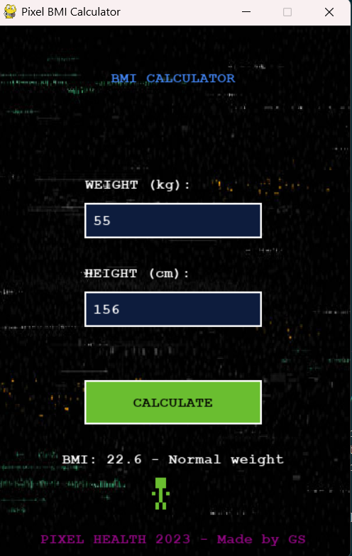

# Pixel-Bmi-Calculator
A retro pixel-art styled BMI calculator made with Python and Pygame, designed as a demo app for an AI-powered Hackathon.

## Features

 Pixel art UI with retro font (Press Start 2P)
 Users can input fields for Weight (in kg) and Height (in cm)
 Real-time BMI calculations with categories:
  - Underweight
  - Normal
  - Overweight
  - Obese
Visual Pixel Characters based on BMI results
Glitch-styled pixel background and button hover effects

## Demo Preview



## How to run?

### Requirements:
- Python 3.10 or above
- Pygame Library

### Install Pygame
```bash
pip install pygame
```

### Run the App
python Bmi_pixel_app.py

## Folder Structure:
Pixel-BMI-Calculator/
|-Bmi_pixel_app.py
|-screenshot.png
|-README.md
|-.gitignore

## Made By:
(We can write our names and team names here)
Hackathon Demo Project - 2025


